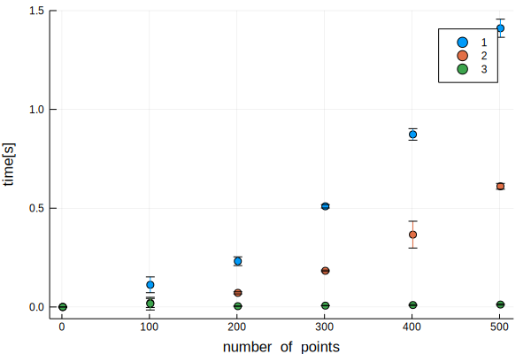
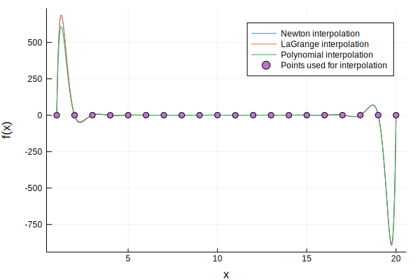

```julia
using Polynomials
using Plots
using DataFrames
using Statistics
```


```julia
function L(Pts, k)
    l=Poly([1])
    for i=1:size(Pts, 1)
        if i!=k
            l=l*(Poly([-Pts[i,1], 1])/(Pts[k, 1]-Pts[i,1]))
        end
    end
    l
end
            
```


    L (generic function with 1 method)


```julia
function interpolateLG(Pts)
    p=Poly([0])
    degree = size(Pts, 1)
    for i=1:size(Pts, 1)
        p=p+(L(Pts, i)*Pts[i, 2])
    end
    p
end
    
```


    interpolateLG (generic function with 1 method)


```julia
function divdiff(Pts)
div_diff = []
push!(div_diff, Pts[:,2])
for i=1:size(Pts, 1)-1
    temp_array = []
    for j=1:size(Pts, 1)-i
        push!(temp_array, (div_diff[i][j]-div_diff[i][j+1])/(Pts[i+j, 1]-Pts[j, 1]))
    end
    push!(div_diff, temp_array)
end
div_diff
end
```


    divdiff (generic function with 1 method)


```julia
function interpolateNewton(Pts)
div=divdiff(Pts)
p = Poly([div[1][1]])
for i=2:size(Pts, 1)
    xes=Poly([1])
    for j=1:i-1
        xes=xes*Poly([Pts[j, 1], -1])
    end
    p=p+div[i][1]*xes
end
p
end
```


    interpolateNewton (generic function with 1 method)


```julia
data=DataFrame(Size = Int[], Time = Float64[], Mode = Int[])
i = 1
for i=1:100:501
    for k=1:10
        xs =  1:1:i
        xsf = 1:0.01:i
        Y = [rand() for x in xs]
        X = [x for x in xs]
        randPts = hcat(X, Y)
        push!(data, Dict(:Size => i, :Time => (@elapsed interpolateLG(randPts)), :Mode => 1))
        push!(data, Dict(:Size => i, :Time => (@elapsed interpolateNewton(randPts)), :Mode => 2))
        push!(data, Dict(:Size => i, :Time => (@elapsed polyfit(randPts[:,1], randPts[:, 2])), :Mode => 3))
    end
end
```


```julia
stat_data=by(data, [:Size, :Mode], :Time => mean, :Time => std)
sort!(stat_data, :Mode)
scatter(stat_data[:Size], stat_data[:Time_mean], group=stat_data[:Mode], xlabel="number_of_points", ylabel = "time[s]", yerr =stat_data[:Time_std])

```





```julia
k = 20
xs =  1:1:k
xsf = 1:0.01:k
Y = [rand() for x in xs]
X = [x for x in xs]
randPts = hcat(X, Y)
```


    20×2 Array{Float64,2}:
      1.0  0.570028 
      2.0  0.086233 
      3.0  0.826572 
      4.0  0.170903 
      5.0  0.375374 
      6.0  0.147648 
      7.0  0.829373 
      8.0  0.182927 
      9.0  0.181252 
     10.0  0.0181552
     11.0  0.462438 
     12.0  0.285648 
     13.0  0.626454 
     14.0  0.527451 
     15.0  0.59581  
     16.0  0.664274 
     17.0  0.911509 
     18.0  0.152452 
     19.0  0.690909 
     20.0  0.225594 


```julia
itpLG = interpolateLG(randPts)
itpPtsLG = [itpLG(x) for x in xsf]
```


    1901-element Array{Float64,1}:
        0.5700275944254827
      -78.78989316307707  
     -152.78305579020525  
     -221.64566727352212  
     -285.60582164430525  
     -344.8837308571674   
     -399.69195007547387  
     -450.23559748055413  
     -496.71256871841615  
     -539.3137460984872   
     -578.2232026537822   
     -613.6184011711739   
     -645.670388298895    
        ⋮                 
      539.5368491599802   
      508.70162091299426  
      474.52062856717384  
      437.3052113422891   
      396.4559554076113   
      352.18483214027947  
      304.0842793582415   
      252.08223212746088  
      196.0391209423542   
      135.5263655204326   
       70.48180726694409  
        0.6898699933954049


```julia
itpNew=interpolateNewton(randPts)
itpPtsNew = [itpNew(x) for x in xsf]
```


    1901-element Array{Float64,1}:
        0.5700275947456248
      -78.78989316275693  
     -152.7830557898269   
     -221.64566727320198  
     -285.6058216439851   
     -344.88373085684725  
     -399.69195007518283  
     -450.2355974801467   
     -496.712568718096    
     -539.3137460981379   
     -578.2232026533748   
     -613.6184011706791   
     -645.6703882984875   
        ⋮                 
      539.1856944592437   
      508.0932708796463   
      474.1601470152091   
      436.8577435837651   
      396.19084611951257  
      351.8508007731871   
      303.6386747266224   
      251.6284057420562   
      195.60237241032883  
      134.8957721470797   
       70.1389203214203   
        0.3460351495305076


```julia
itpPoly = polyfit(randPts[:,1], randPts[:, 2])
itpPtsPoly = [itpPoly(x) for x in xsf]
```


    1901-element Array{Float64,1}:
        0.5700275946874171
      -71.45522960665403  
     -138.61008048045915  
     -201.10887774667935  
     -259.1586115057289   
     -312.95911879625055  
     -362.7032880738261   
     -408.577258717909    
     -450.76061567032593  
     -489.4265793096565   
     -524.7421906596865   
     -556.8684920310916   
     -585.9607031959749   
        ⋮                 
      531.321688646829    
      500.6221541892737   
      467.0661727715051   
      430.32418779598083  
      390.11922083763056  
      346.42325064804754  
      299.02990441047587  
      247.87495170885813  
      192.48143728610012  
      132.8584578804148   
       68.93524204089772  
        0.2748728331644088


```julia
plot(xsf,itpPtsNew, label="Newton interpolation")
plot!(xsf,itpPtsLG, label="LaGrange interpolation")
plot!(xsf, itpPtsPoly, label="Polynomial interpolation")
scatter!(xs, Y, label="Points used for interpolation")
```





