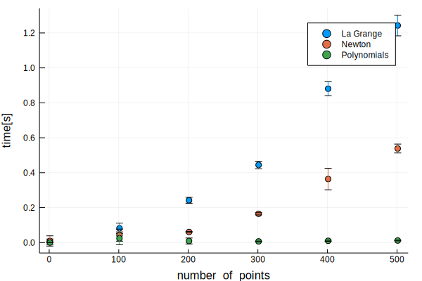

Używane funkcje
===============


Funkcja obliczająca wielomiany potrzebne do stworzenia wielomianu aproksymującego Lagrange'a
--------------------------------------------------------------------------------------------

```julia
function L(Pts, k)
    l=Poly([1])
    for i=1:size(Pts, 1)
        if i!=k
            l=l*(Poly([-Pts[i,1], 1])/(Pts[k, 1]-Pts[i,1]))
        end
    end
    l
end
            
```


    L (generic function with 1 method)


Funkcja obliczająca wielomian aproksymujący za pomocą metody Lagrange'a
-----------------------------------------------------------------------

```julia
function interpolateLG(Pts)
    p=Poly([0])
    degree = size(Pts, 1)
    for i=1:size(Pts, 1)
        p=p+(L(Pts, i)*Pts[i, 2])
    end
    p
end
    
```


    interpolateLG (generic function with 1 method)


Funkcja obliczająca ilorazy różnicowe potrzebne w metodzie Newtona
------------------------------------------------------------------

```julia
function divdiff(Pts)
div_diff = []
push!(div_diff, Pts[:,2])
for i=1:size(Pts, 1)-1
    temp_array = []
    for j=1:size(Pts, 1)-i
        push!(temp_array, (div_diff[i][j]-div_diff[i][j+1])/(Pts[i+j, 1]-Pts[j, 1]))
    end
    push!(div_diff, temp_array)
end
div_diff
end
```


    divdiff (generic function with 1 method)


Funkcja tworząca wielomian aproksymujący za pomocą metody Newtona
-----------------------------------------------------------------

```julia
function interpolateNewton(Pts)
div=divdiff(Pts)
p = Poly([div[1][1]])
for i=2:size(Pts, 1)
    xes=Poly([1])
    for j=1:i-1
        xes=xes*Poly([Pts[j, 1], -1])
    end
    p=p+div[i][1]*xes
end
p
end
```


    interpolateNewton (generic function with 1 method)


Testy funkcji interpolujących
=============================

```julia


data=DataFrame(Size = Int[], Time = Float64[], Mode = Int[])
i = 1
for i=1:100:501
    for k=1:10
        xs =  1:1:i
        xsf = 1:0.01:i
        Y = [rand() for x in xs]
        X = [x for x in xs]
        randPts = hcat(X, Y)
        push!(data, Dict(:Size => i, :Time => (@elapsed interpolateLG(randPts)), :Mode => 1))
        push!(data, Dict(:Size => i, :Time => (@elapsed interpolateNewton(randPts)), :Mode => 2))
        push!(data, Dict(:Size => i, :Time => (@elapsed polyfit(randPts[:,1], randPts[:, 2])), :Mode => 3))
    end
end
```


```julia
stat_data=by(data, [:Size, :Mode], :Time => mean, :Time => std)
sort!(stat_data, :Mode)
scatter(stat_data[:Size], stat_data[:Time_mean], group=stat_data[:Mode], xlabel="number_of_points", ylabel = "time[s]", yerr =stat_data[:Time_std])

```


Wyniki testów
-------------



Jak widać, z dwóch napisanych funkcji metoda Newtona oferuje krótszy czas działania, nadal jest jednak wolniejsza od funkcji polyfit wbudowanej w pakiet Polynomials w języku Julia


Wyniki działania funkcji interpolujących na losowym zbiorze punktów
===================================================================


```julia
plot(xsf,itpPtsNew, label="Newton interpolation")
plot!(xsf,itpPtsLG, label="LaGrange interpolation")
plot!(xsf, itpPtsPoly, label="Polynomial interpolation")
scatter!(xs, Y, label="Points used for interpolation")
```


Wszystkie funkcje oferują w badanym obszarze podobną dokładność. Jak widać, na krańcach przedziału, w którym dokonywaliśmy interpolacji dokładność naszego przybliżenia jest coraz mniejsza. 

